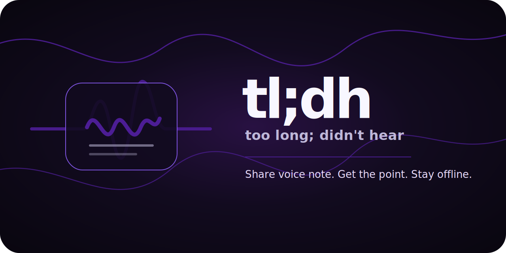

<p align="center">
  
</p>

# tl;dh

**too long; didn't hear**

Voice notes are too long. Your time is not. `tl;dh` is an Android Share Target that turns WhatsApp voice notes into a concise, copy-ready brief — locally, offline, and session-only.

> **Status:** `v0.1.0` bootstrap. The Share Target and UI flow are implemented with a fake summarizer. Real local transcription starts in `v0.3.0`.


## What it solves

WhatsApp voice notes are often long, unstructured, and time-expensive. `tl;dh` lets you share an audio file into the app and receive:

- TL;DR
- key points
- tags
- category
- reply suggestions
- copy-ready output

## MVP flow

```text
WhatsApp audio → Android Sharesheet → tl;dh → local inspect/transcribe/summarize → copy result → session wipe
```

## Supported sources

| Source | Status | Notes |
|---|---:|---|
| WhatsApp `.opus` voice notes | Primary | Main target |
| Telegram `.ogg` audio | Secondary | Supported if the same Ogg/Opus path works cleanly |
| Instagram | Out of scope | No useful external audio share flow |
| Facebook Messenger | Out of scope | No useful external audio share flow |

## Privacy model

Core behavior:

- no cloud speech-to-text
- no cloud summarization
- no analytics
- no telemetry
- no account
- no database in the MVP
- no persistent audio/transcript/result storage
- session files wiped on start and explicit close

Important: Android does not guarantee every lifecycle callback after a hard process kill. `tl;dh` therefore wipes orphaned session files at next startup. Clipboard content is controlled by Android after you copy text.

## Build flavors

| Flavor | Internet permission | Purpose |
|---|---:|---|
| `offlineRelease` | No | Maximum privacy/local-only build |
| `updaterRelease` | Yes | Manual GitHub stable-release update check and APK installer |

The audio pipeline remains local in both flavors. The updater flavor must never perform silent/background checks in the MVP.

## Technical baseline

- Kotlin `2.4.0`
- Android Gradle Plugin `9.2.1`
- Jetpack Compose BOM `2026.04.01`
- `compileSdk = 36`
- `targetSdk = 36`
- `minSdk = 28`
- primary ABI: `arm64-v8a`
- package: `dev.bitsbots.tldh`

## Local build

This repository includes `scripts/gradle.sh`, which uses an existing Gradle installation or bootstraps Gradle `9.4.1` locally.

```bash
bash scripts/gradle.sh lintOfflineDebug testOfflineDebugUnitTest assembleOfflineDebug
```

Build release APKs:

```bash
bash scripts/gradle.sh assembleOfflineRelease assembleUpdaterRelease
```

For real signed releases, configure:

```text
ANDROID_KEYSTORE_FILE
ANDROID_KEYSTORE_PASSWORD
ANDROID_KEY_ALIAS
ANDROID_KEY_PASSWORD
```

## Release discipline

- SemVer tags: `v0.1.0`, `v0.2.0`, ...
- `versionName` follows SemVer
- `versionCode` is monotonically increasing
- Release APKs are signed with the same key for update compatibility
- GitHub Releases include APKs, SHA256 sums, and `release-manifest.json`

## Stable updater rule

The in-app updater does **not** blindly install `latest`.

A release is eligible only if:

- not draft
- not prerelease
- valid SemVer tag
- APK asset exists
- SHA256 exists and verifies
- not yanked
- stable release manifest validates

## Roadmap

| Version | Goal |
|---:|---|
| `0.1.0` | Share Target MVP + fake summarizer |
| `0.2.0` | Audio ingest + Ogg/Opus detection hardening |
| `0.3.0` | Local `whisper.cpp` transcription |
| `0.4.0` | Session wipe + privacy hardening |
| `0.5.0` | TL;DR + key points |
| `0.6.0` | Tags + categories |
| `0.7.0` | Reply suggestions |
| `0.8.0` | Manual stable in-app updater |
| `0.9.0` | Testing, benchmarking, RC |
| `1.0.0` | Public stable release |

## Brand

`tl;dh` uses a dark, local-first visual system with pulsating purple gradient lines. Brand assets live in [`docs/brand`](docs/brand/README.md).

## License

MIT. See [LICENSE](LICENSE).
