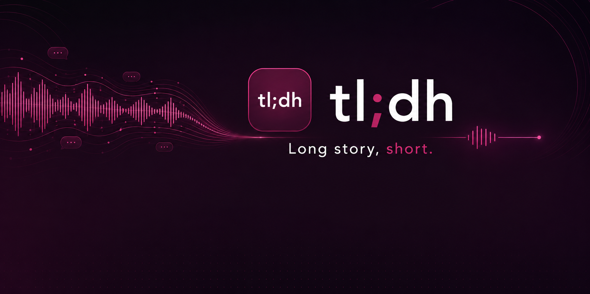

<p align="center">
  
</p>

# tl;dh STT Bench

Separate Android-Benchmark-App für die STT-Engine-Entscheidung von **tl;dh**. Die Haupt-App bleibt unberührt.

## v0.2.1 Fokus

Diese Version bleibt primär bei **Vosk**, erweitert den Test aber auf mehrere deutsche Modelle, die live ohne App-Neustart heruntergeladen, gewechselt und gegen dieselbe Audio gebenchmarkt werden können. Zusätzlich speichert die App lokal die letzten 5 Benchmark-Läufe, die bei Bedarf eingeblendet werden können.

## Modelle

| Modell | Größe | Ampel-Idee | Zweck |
|---|---:|---|---|
| `vosk-model-small-de-0.15` | 45 MB | Speed grün / Genauigkeit gelb | Phone Fast Mode Kandidat |
| `vosk-model-small-de-zamia-0.3` | 49 MB | Speed grün / Genauigkeit rot | Gegenprobe, nicht empfohlen |
| `vosk-model-de-0.21` | 1.9 GB | Speed rot / Genauigkeit grün | Quality-/Tower-Vergleich |
| `vosk-model-de-tuda-0.6-900k` | 4.4 GB | Speed rot / Genauigkeit grün | Extrem-/Tower-Vergleich |

Die Ampel ist bewusst eine Vorab-Einschätzung. Entscheidend sind Deine echten Benchmark-Werte.

## Flow

```text
WhatsApp Audio teilen
→ tl;dh STT Bench auswählen
→ Modell wählen/downloaden
→ Benchmark starten
→ Modell ohne Neustart wechseln
→ erneut benchmarken
→ Zeiten/RTF/Transkript vergleichen
```

## Letzte 5 Benchmarks

Nach jedem erfolgreichen Benchmark speichert die App lokal eine kompakte Historie mit Modell, Audio-Dauer, Gesamtzeit, RTF, Verdict, Transkript-Vorschau und vollständigem erkanntem Transkript mit Zeitstempeln. Es werden maximal 5 Läufe behalten; ältere Einträge fallen automatisch heraus. Die Historie kann im UI angezeigt oder gelöscht werden.

## Reset

Nach jedem Benchmark kann das Ergebnis per **Reset** sofort geleert werden, ohne die App neu zu starten. Die geteilte Audio und installierte Modelle bleiben erhalten, sodass mehrere Modelle bequem gegen dieselbe Audio verglichen werden können.

## Datenschutz

- Keine Cloud-STT.
- Modell-Download nur auf Nutzerklick.
- Geteilte Audio wird lokal verarbeitet.
- Benchmark-App ist getrennt von tl;dh.
